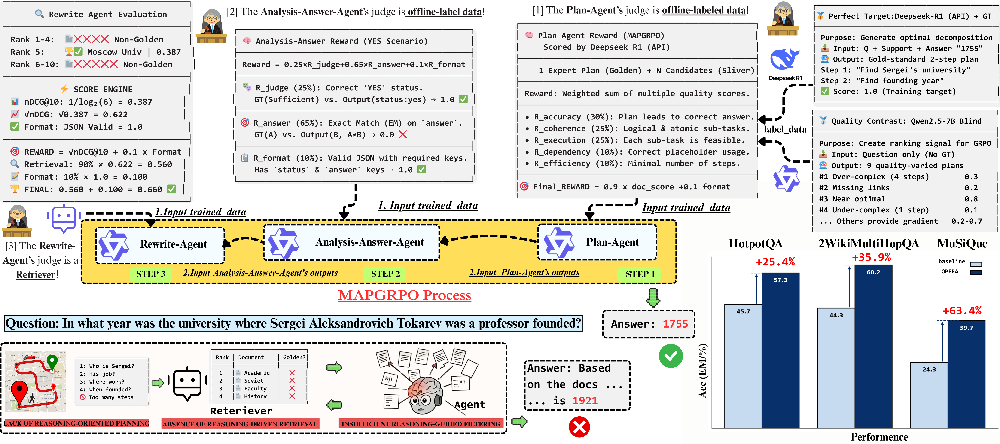
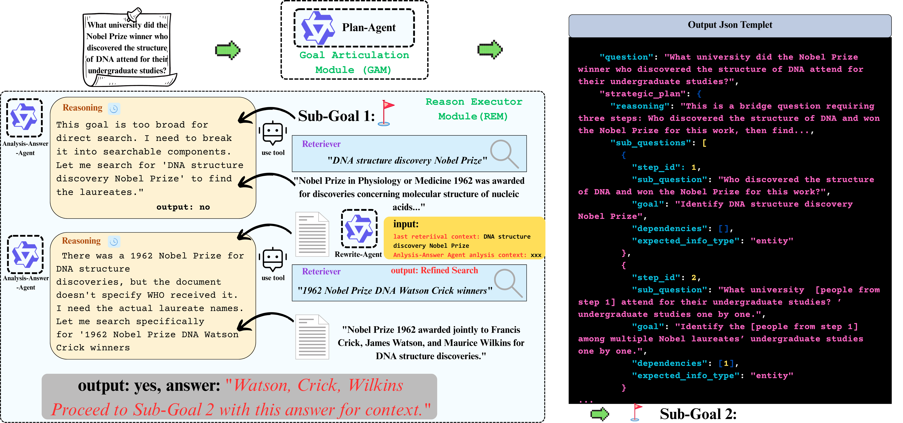

# OPERA: Orchestrated Planner-Executor Reasoning Architecture

[](https://arxiv.org/abs/2508.16438)
[](https://www.python.org/downloads/)
[](LICENSE)
[](https://ameame1.github.io/OPERA/)

## 🌐 Project Homepage

🔗 **Visit our project homepage: [https://ameame1.github.io/OPERA/](https://ameame1.github.io/OPERA/)**

## 📢 News

- **[2025-11-08]** 🎉 Our paper has been accepted by **AAAI 2026 Main Track**!

## 🎯 Overview

OPERA is a reinforcement learning-enhanced framework for reasoning-centric multi-hop retrieval that introduces a hierarchical three-agent architecture to systematically decouple strategic planning from tactical execution.

<div align="center">
  
  <p><i>Figure 1: OPERA's three-agent architecture with placeholder mechanism and MAPGRPO training</i></p>
</div>

## 🚀 Key Innovations

### 1️⃣ **Hierarchical Three-Agent Architecture**
- **Plan Agent**: Decomposes complex queries into logical sub-questions with dependency tracking
- **Analysis-Answer Agent**: Executes plans and extracts information from retrieved documents  
- **Rewrite Agent**: Optimizes queries for better retrieval performance

### 2️⃣ **Placeholder Mechanism**
Revolutionary dependency tracking through `[entity from step X]` references that ensures proper information flow between reasoning steps.

### 3️⃣ **MAPGRPO Training**
Multi-Agent Progressive Group Relative Policy Optimization with role-specific reward functions:

<div align="center">
  
  <p><i>Figure 2: MAPGRPO training framework with progressive agent optimization and multi-dimensional rewards</i></p>
</div>

## 📊 Performance

OPERA achieves state-of-the-art results on multi-hop QA benchmarks:

| Model | HotpotQA EM | HotpotQA F1 | 2WikiMQA EM | 2WikiMQA F1 | MuSiQue EM | MuSiQue F1 |
|-------|-------------|-------------|-------------|-------------|------------|------------|
| Qwen2.5-7B (No Retrieval) | 18.5 | 26.8 | 16.2 | 23.7 | 4.1 | 9.1 |
| Single-Step RAG | 31.5 | 44.2 | 25.9 | 37.6 | 14.1 | 18.4 |
| IRCoT | 42.7 | 54.8 | 43.3 | 56.2 | 18.8 | 23.9 |
| OPERA (CoT) | 44.9 | 58.5 | 42.3 | 50.7 | 21.2 | 26.4 |
| Adaptive-RAG | 45.7 | 56.9 | 30.1 | 39.3 | 24.3 | 35.7 |
| BGM | 41.5 | 53.8 | 44.3 | 55.8 | 19.6 | 26.8 |
| **OPERA (MAPGRPO)** | **57.3** | **69.5** | **60.2** | **72.7** | **39.7** | **51.9** |

## 🛠️ Installation

### Requirements
- Python 3.8+
- PyTorch 2.0+
- Transformers 4.35+

### Setup
```bash
# Clone the repository
git clone https://github.com/Ameame1/OPERA.git
cd OPERA

# Install dependencies
pip install -r requirements.txt

# Download model checkpoints (if available)
python download_models.py
```

## 🚦 Quick Start

### Basic Usage

```python
from opera_cot_rag_baseline import OPERACoTRAGBaseline

# Initialize OPERA system
opera = OPERACoTRAGBaseline()

# Complex multi-hop question
question = "What is the GDP per capita of the country where the headquarters of the company that acquired GitHub is located?"

# Get answer with full reasoning trajectory
answer, trajectory = opera.answer_question(question)

print(f"Answer: {answer}")
print(f"Reasoning steps: {len(trajectory.execution_traces)}")
```

### Example Output

```python
# Plan Agent Output
Plan:
1. Which company acquired GitHub?
2. Where is [company from step 1] headquartered?
3. What country is [location from step 2] in?
4. What is the GDP per capita of [country from step 3]?

# Analysis-Answer Agent Execution
Step 1: Microsoft acquired GitHub
Step 2: Microsoft is headquartered in Redmond, Washington
Step 3: Redmond is in the United States
Step 4: US GDP per capita is approximately $76,000

# Final Answer
$76,000
```

## 📁 Project Structure

```
OPERA/
├── src/
│   ├── agents/                 # Three agent implementations
│   │   ├── plan_agent.py       # Strategic planning
│   │   ├── analysis_answer_agent.py  # Execution & analysis
│   │   └── rewrite_agent.py    # Query optimization
│   ├── core/
│   │   ├── orchestrator.py     # Agent coordination
│   │   └── trajectory_memory.py # Execution tracking
│   ├── training/
│   │   ├── mapgrpo_base.py     # MAPGRPO framework
│   │   └── reward_functions.py # Multi-dimensional rewards
│   └── utils/
│       └── placeholder_filler.py # Dependency resolution
├── data/                        # Training datasets
├── config/
│   └── opera_config.yaml       # System configuration
├── docs/                        # Documentation & figures
└── example_usage.py            # Demo script
```

## 🎓 Training

Our training framework is built upon [TRL (Transformer Reinforcement Learning)](https://github.com/huggingface/trl), HuggingFace's library for training transformer language models with reinforcement learning.

### MAPGRPO Training Pipeline

```python
from src.training.mapgrpo_trainer import MAPGRPOTrainer

# Initialize trainer
trainer = MAPGRPOTrainer(
    group_size=5,
    kl_coeff=0.01,
    learning_rate=1e-5
)

# Stage 1: Train Plan Agent
trainer.train_plan_agent(epochs=3)

# Stage 2: Train Analysis Agent (Plan Agent frozen)
trainer.train_analysis_agent(epochs=3)

# Stage 3: Train Rewrite Agent (Others frozen)
trainer.train_rewrite_agent(epochs=3)
```

### Reward Functions

Each agent has specialized reward components:

- **Plan Agent**: Correctness, coherence, efficiency
- **Analysis Agent**: Answer accuracy, evidence quality
- **Rewrite Agent**: Query clarity, retrieval effectiveness

## 📈 Evaluation

```bash
# Run evaluation on HotpotQA
python evaluate.py --dataset hotpotqa --split test

# Run evaluation on MuSiQue
python evaluate.py --dataset musique --split test

# Generate detailed analysis
python analyze_results.py --input results/opera_predictions.json
```

## 🔧 Configuration

Modify `config/opera_config.yaml` to customize:

```yaml
agents:
  plan_agent:
    model: "Qwen/Qwen2.5-7B-Instruct"
    temperature: 0.7
  analysis_agent:
    model: "Qwen/Qwen2.5-7B-Instruct"
    temperature: 0.5
  rewrite_agent:
    model: "Qwen/Qwen2.5-3B-Instruct"
    temperature: 0.3

training:
  mapgrpo:
    group_size: 5
    kl_coefficient: 0.01
    learning_rate: 1e-5
    epochs: 3
```

## 📝 Citation

If you use OPERA in your research, please cite:

```bibtex
@article{opera2025,
  title={OPERA: Orchestrated Planner-Executor Reasoning Architecture for Reasoning-Centric Retrieval},
  author={Anonymous},
  journal={arXiv preprint arXiv:2508.16438},
  year={2025},
  url={https://arxiv.org/abs/2508.16438}
}
```

## 🙏 Acknowledgements

This research is supported by the National Key R&D Program of China (No. 2023YFC3303800).

We thank the open-source community for their valuable contributions and the anonymous reviewers for their insightful feedback.

## 📧 Contact

For questions and discussions, please contact:
- liuyu@iie.ac.cn
- mzyth@tsinghua.edu.cn

---

<div align="center">
  <b>🌟 Star us on GitHub if you find this work helpful!</b>
</div>