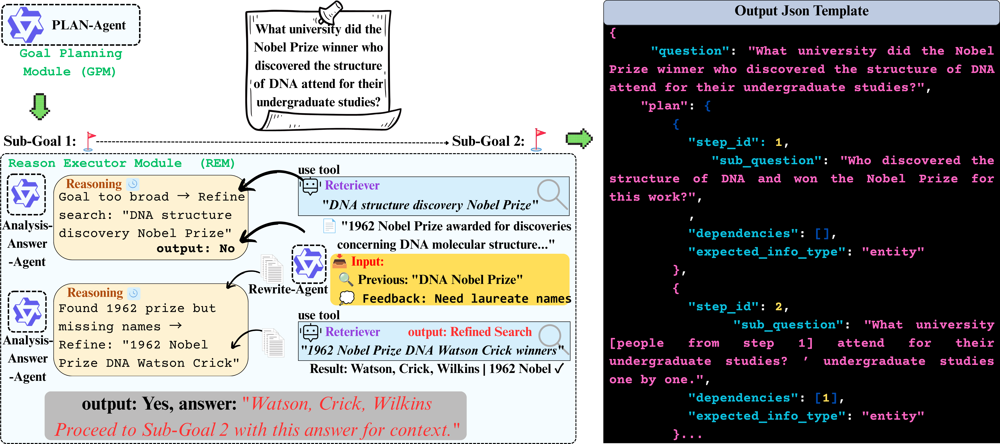

# OPERA: Orchestrated Planner-Executor Reasoning Architecture

[](https://arxiv.org/pdf/2508.16438)
[](https://ameame1.github.io/OPERA/)
[](https://huggingface.co/datasets/Ameame1002/OPERA)

## 📢 News

- **[2025-11-08]** 🎉 Our paper has been accepted by **AAAI 2026 Main Track**! (Also my first PhD work — many thanks to everyone who helped along the way. 😊)

## 🎯 Overview

OPERA is a reinforcement-learning-enhanced framework for multi-hop retrieval. Existing pipelines treat retrieval and reasoning as two disjoint stages — retrieve first, reason after. OPERA fuses them through a hierarchical three-agent architecture that **reasons while retrieving**: each retrieval step is shaped by the current reasoning state, and each reasoning step drives the next retrieval.

## 💻 Code

The final inference pipeline is released under [`src/`](src/). It includes the Plan Agent, BGE-M3 retriever, Analysis-Answer Agent, Rewrite Agent, final synthesis, evaluation scripts, and the 1.78M index rebuild utilities. Training code is intentionally not included in this inference release.

The runtime flow is:

1. Plan Agent decomposes a multi-hop question into ordered sub-goals.
2. BGE-M3 retrieves evidence from the merged FAISS knowledge base.
3. Analysis-Answer Agent answers the current sub-goal when retrieved evidence is sufficient.
4. Rewrite Agent reformulates the retrieval query only after insufficient evidence.
5. A final synthesis step combines executed sub-goal answers into the final answer.

Source layout:

- [`src/opera/`](src/opera/): OPERA package, CLI, pipeline, prompts, retriever, and evaluator.
- [`src/scripts/run_retriever_server.sh`](src/scripts/run_retriever_server.sh): keep BGE-M3 and the FAISS index resident on GPU0.
- [`src/scripts/run_single.sh`](src/scripts/run_single.sh): run one question against the persistent retriever.
- [`src/scripts/run_all3_eval.sh`](src/scripts/run_all3_eval.sh): run HotpotQA, 2WikiMultiHopQA, and MuSiQue evaluation JSONL files.
- [`src/scripts/build_eval_sets.py`](src/scripts/build_eval_sets.py): sample evaluation splits with any random seed from official dev files.
- [`src/scripts/build_opera_index.py`](src/scripts/build_opera_index.py): rebuild the final 1.78M index variant.
- [`src/scripts/verify_gold_coverage.py`](src/scripts/verify_gold_coverage.py): verify support-document coverage before building.

### Environment

```bash
cd src
conda create -n opera python=3.10 -y
conda activate opera
pip install -r requirements.txt
```

For GPU FAISS, install the FAISS build that matches your CUDA stack. The pipeline defaults to GPU0.

The main models are:

- Retriever: `BAAI/bge-m3`
- Plan and Analysis-Answer: `Qwen/Qwen2.5-7B-Instruct`
- Rewrite: `Qwen/Qwen2.5-3B-Instruct`

Local model/index paths can be overridden with:

```bash
export OPERA_BGE_MODEL=/path/to/bge-m3
export OPERA_QWEN25_7B_MODEL=/path/to/Qwen2.5-7B-Instruct
export OPERA_QWEN25_3B_MODEL=/path/to/Qwen2.5-3B-Instruct
export OPERA_INDEX_PATH=/path/to/OPERA-index.index
export OPERA_METADATA_PATH=/path/to/OPERA-index.meta
```

The pre-built 1.78M-chunk index is hosted on Hugging Face Datasets and can be downloaded from:
[https://huggingface.co/datasets/Ameame1002/OPERA](https://huggingface.co/datasets/Ameame1002/OPERA)

By default, place the downloaded index under:

```text
src/indexes/OPERA-index.index
src/indexes/OPERA-index.meta
```

### Run

Start the persistent retriever:

```bash
cd src
CUDA_VISIBLE_DEVICES=0 ./scripts/run_retriever_server.sh
```

Run one question:

```bash
cd src
CUDA_VISIBLE_DEVICES=0 ./scripts/run_single.sh \
  "What books about finance has the author of The Big Short written?"
```

Equivalent direct CLI:

```bash
CUDA_VISIBLE_DEVICES=0 python -m opera \
  --question "What books about finance has the author of The Big Short written?" \
  --llm-backend transformers \
  --retriever-backend http \
  --retriever-url http://localhost:8110 \
  --top-k 5 \
  --top-k-schedule 5,10,15 \
  --max-docs-in-prompt 15 \
  --max-doc-chars 1500 \
  --max-steps 6 \
  --max-rewrites 2 \
  --multi-query-dependencies \
  --include-original-query \
  --final-synthesis \
  --continue-on-step-failure
```

### Evaluation

To evaluate, sample your own split from the official dev sets of [HotpotQA](https://hotpotqa.github.io), [2WikiMultiHopQA](https://github.com/Alab-NII/2wikimultihop), and [MuSiQue](https://github.com/StonyBrookNLP/musique) using [`src/scripts/build_eval_sets.py`](src/scripts/build_eval_sets.py) (any seed; the script is fully deterministic), then run [`src/scripts/run_all3_eval.sh`](src/scripts/run_all3_eval.sh). Outputs are written under `src/eval_runs/` with `results.jsonl`, full traces, and aggregate summaries.

Notes:

- The prompts are based on the OPERA paper roles, with additional grounding constraints added during debugging.
- The code uses retrieval and prompt-level control only; it does not inject gold answers or supporting facts into prompts.
- The evaluator supports multiple gold aliases and keeps the invariant `F1 >= EM`.

<div align="center">
  
  <p><i>Figure 1: OPERA's three-agent architecture with placeholder mechanism and MAPGRPO training</i></p>
</div>

## 🚀 Key Innovations

### 1️⃣ **Hierarchical Three-Agent Architecture**
- **Plan Agent**: Decomposes complex queries into logical sub-questions with dependency tracking
- **Analysis-Answer Agent**: Executes plans and extracts information from retrieved documents  
- **Rewrite Agent**: Optimizes queries for better retrieval performance

### 2️⃣ **Placeholder Mechanism**
Revolutionary dependency tracking through `[entity from step X]` references that ensures proper information flow between reasoning steps.

### 3️⃣ **MAPGRPO Training**
Multi-Agent Progressive Group Relative Policy Optimization with role-specific reward functions:

<div align="center">
  
  <p><i>Figure 2: MAPGRPO training framework with progressive agent optimization and multi-dimensional rewards</i></p>
</div>

> **📌 Note on Plan-Agent Training**
>
> Unlike the Analysis-Answer Agent (supervised by exact-match against ground-truth answers) and the Rewrite Agent (supervised by NDCG@k against golden documents), the Plan Agent has no single "correct" decomposition — multiple valid plans can solve the same multi-hop query. This open-endedness is where we invested the bulk of our engineering effort:
>
> - At each training step, the Plan Agent always rolls out a fixed group of G = 8 on-policy "silver" candidates. G (the group size) is the GRPO hyperparameter controlling how many alternatives are compared in each policy update — a larger G gives a more stable group-baseline at the cost of compute, and we found G = 8 to be a good trade-off for this open-ended objective.
> - To stabilize learning, an offline gold reference (selected by best-of-N from DeepSeek R1) is periodically injected into the group at refresh points. The group size stays fixed at 8: gold replaces the lowest-scoring silver, so the composition becomes 7 silver + 1 gold only at those refresh points. The gold sample anchors the group baseline but does not contribute a direct gradient term — it nudges the policy toward higher-quality decompositions while preserving on-policy exploration.
> - DeepSeek R1 plays a dual role in Plan-Agent training: (i) offline, it generates and scores the candidate decompositions from which the gold reference $c_{\text{best}}$ is selected (best-of-N) to populate the pre-scored anchor pool $\mathcal{D}_{\text{scored}}$; (ii) online during training, R1 also acts as the external judge model that scores the on-policy silver rollouts under the same planning rubric — supplying the scalar reward used by GRPO. Using a single, consistent judge across offline and online phases ensures that the gold anchor and the silver candidates are evaluated on a directly comparable scale.
> - Analysis-Answer and Rewrite agents do not use gold injection: their reward signals are already grounded in objective metrics (EM, NDCG), so a separate judge is unnecessary.

---

> **🎯 Important Note**
>
> Multi-agent systems have demonstrated significant contributions across various domains, and researchers from both academia and industry are actively exploring their potential. This work introduces novel approaches to **multi-agent collaboration** and **retrieval-augmented question answering**, including:
> - A hierarchical three-agent architecture with systematic planning-execution decoupling
> - Multi-Agent Progressive Group Relative Policy Optimization (MAPGRPO) training framework
> - Role-specific reward functions for reinforcement learning in RAG systems
>
> If you find our **reward design**, **architectural patterns**, or **training methodologies** useful for your research, we kindly ask you to [cite our work](#-citation).

## 📊 Performance

OPERA achieves leading results on multi-hop QA benchmarks (1.7M closed-domain corpus):

| Model | HotpotQA EM | HotpotQA F1 | 2WikiMQA EM | 2WikiMQA F1 | MuSiQue EM | MuSiQue F1 |
|-------|-------------|-------------|-------------|-------------|------------|------------|
| Qwen2.5-7B (No Retrieval) | 18.5 | 26.8 | 16.2 | 23.7 | 4.1 | 9.1 |
| Single-Step RAG | 31.5 | 44.2 | 25.9 | 37.6 | 14.1 | 18.4 |
| IRCoT | 42.7 | 54.8 | 43.3 | 56.2 | 18.8 | 23.9 |
| **OPERA (CoT)** | **44.9** | **58.5** | **42.3** | **50.7** | **21.2** | **32.1** |
| Adaptive-RAG | 45.7 | 56.9 | 30.1 | 39.3 | 24.3 | 35.7 |
| BGM | 41.5 | 53.8 | 44.3 | 55.8 | 19.6 | 26.8 |
| **OPERA (MAPGRPO)** | **57.3** | **69.5** | **60.2** | **72.7** | **39.7** | **58.0** |

> **📌 Note on the Knowledge Base**
>
> All three datasets (HotpotQA, 2WikiMultiHopQA, Musique) ship with their own official distractor documents — paragraphs released alongside the questions to provide a realistic search space. Our 1.7M-chunk closed-domain corpus is built by merging these official distractor pools across all three datasets and supplementing them with a curated subset of official Wikipedia pages to fill in evident coverage gaps. Since Musique is currently the most challenging of the three benchmarks, the corpus is deliberately constructed around it — its distractor pool and supporting entities anchor the merge, with the other two datasets layered on top. The corpus is sentence-level indexed with BGE-M3 + FAISS.
>
> The design goal is straightforward: guarantee that, under the sub-queries produced by the Plan Agent, the retriever can actually surface the golden supporting documents. If the golden documents are not even reachable at the retrieval stage, no amount of downstream reasoning by the Analysis-Answer or Rewrite Agent can recover the correct answer — retrieval is the upstream bottleneck that gates everything that follows. Note that this still constitutes a closed-domain setting; extending OPERA to a full open-domain web-scale corpus is part of our follow-up work.

## 🎓 Training Framework

Our training methodology is built on top of [TRL (Transformer Reinforcement Learning)](https://github.com/huggingface/trl). MAPGRPO is an enhanced variant of [GRPO (Group Relative Policy Optimization)](https://arxiv.org/abs/2501.12948), with progressive multi-agent training and role-specific reward functions. Full hyperparameter tables and implementation details are reported in the paper.

---

## Limitations & Future Work

The current leading approaches for multi-hop retrieval still rely on agent architectures, yet most existing works are evaluated on relatively small, closed-domain knowledge bases. We acknowledge that this closed-domain setting substantially shapes final performance: within such a setting, carefully curated training data combined with long RL training does produce smooth, attractive-looking reward curves and respectable numbers. The catch is that, under the same architecture, plain CoT inference is already competitive — and a stronger API LLM can typically match or surpass these results without the heavy time and hardware cost of multi-stage RL training. In short, **the curves look better than the practical payoff**.

This paper is no exception. Our contributions should therefore be read primarily in terms of:

- **Architecture design** — the three-agent decoupling of planning, analysis, and rewriting.
- **Reward function design** — role-specific scalar rewards under the MAPGRPO objective.

We also note two practical caveats of MAPGRPO itself:

- **Training cost.** Sequential per-agent optimization with group rollouts and judge-based scoring is computationally heavy, materially longer than a comparable single-agent SFT or GRPO run.
- **Expert-injection sensitivity.** The high-score sample injection is tightly coupled with the difficulty of the current mini-batch: on hard batches the injected expert candidate acts as a stabilizing anchor, but on easy batches the injected slot is largely wasted — displacing an otherwise informative on-policy candidate and offering no additional learning signal.

A natural direction to address both of the above is to train each agent independently with a dedicated pipeline and curriculum, decoupling the role-specific objectives entirely from the joint group-rollout schedule. We will demonstrate this empirically in our follow-up work.

---

# 🚀 Coming Soon — Next-Generation: **PRISMA**

Building on the design philosophy of this work and the pitfalls we encountered along the way, **PRISMA** introduces a **self-reflective agent** and is deployed on a truly open-domain, large-scale knowledge base. To address the practical caveats noted above (training cost, expert-injection sensitivity), PRISMA adopts a **revised training scheme** in which each agent is optimized independently with its own pipeline, curriculum, and reward signal — fully decoupling the role-specific objectives from any joint group-rollout schedule.

Upon release, the complete framework will be open-sourced, including the revised training methodology in full detail, source code, and Hugging Face model weights.

---

## 📝 Citation

> 📄 **Note:** Per AAAI policy, after publication we released an updated **extended version** on arXiv that includes additional experimental details and analyses beyond the AAAI page limit, along with minor corrections to a few errata. For the definitive reference, please consult the latest arXiv extended version: [arXiv:2508.16438](https://arxiv.org/pdf/2508.16438). Should any further ambiguities or errors come to light, we will continue to update both the arXiv extended version and this GitHub repository accordingly.

If you use OPERA in your research, please cite:

```bibtex
@article{liu2025opera,
  title   = {{OPERA}: A Reinforcement Learning--Enhanced Orchestrated Planner-Executor Architecture for Reasoning-Oriented Multi-Hop Retrieval},
  author  = {Liu, Yu and Liu, Yanbing and Yuan, Fangfang and Cao, Cong and Sun, Youbang and Peng, Kun and Chen, Weizhuo and Li, Jianjun and Ma, Zhiyuan},
  journal = {arXiv preprint arXiv:2508.16438},
  year    = {2025}
}
```

---

<div align="center">
  <b>🌟 Star us on GitHub if you find this work helpful!</b>
</div>
